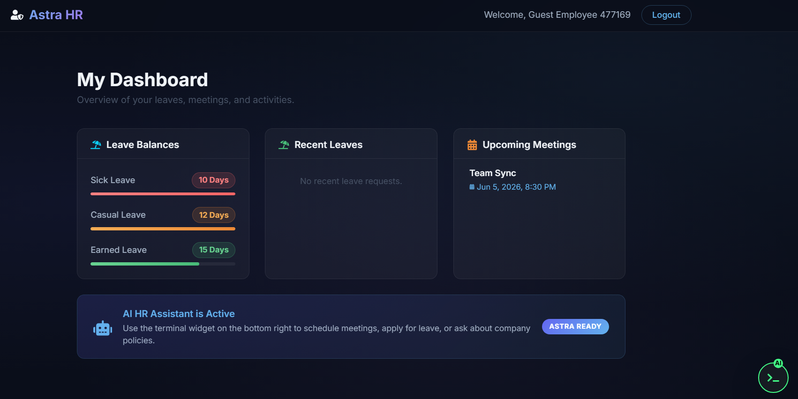

# Astra HR: AI-Powered HR Assistant


---

A MERN Stack Astra HR system to manage employee leaves, schedule meetings, and interact with an AI Assistant via a custom terminal widget. <br>
Built with a React frontend, Express/Node backend, MongoDB database.

---

## Demo Link

[Live Demo](#)

---

## Quick Start

```
git clone https://github.com/Sourabhpande532/AstraAIs.git
cd AstraAI
npm install
npm run dev  # or `npm start` / `yarn dev`
```

---

## Technologies

- React Js (Vite)
- Redux Toolkit
- React Router
- Node Js
- Express Js
- MongoDB
- Server-Sent Events (SSE)
- RESTful APIs

---

## Demo Video

Watch a walkthrough (5-7 minutes) of all major features of this app: <br>
[Drive Video Link](#)

---

## Features

**Employee Dashboard**

- Overview of leave balances with visual progress bars (`Sick`, `Casual`, `Earned`)
- Recent leave requests history and status tracking
- Upcoming scheduled meetings with dates and titles

**AI HR Terminal Widget**

- Draggable, minimizable, custom-built AI terminal interface
- Real-time streaming responses via Server-Sent Events (SSE)
- Agentic execution for multi-step prompts (e.g., checking leave balance -> applying for leave -> scheduling doctor appointment)

**Leave Management**

- Check current leave balances
- Apply for leaves automatically through AI or manually
- Validation against available leave balance

**Meeting Scheduling**

- Schedule meetings dynamically via AI natural language processing
- Meetings are instantly synced with the frontend via Redux state

**Authentication**

- Secure Employee Login and Registration
- Quick "Guest Login" feature for easy access

**Responsive Premium UI**

- Custom dark mode, glassmorphism cards, and animated gradient bars
- Mobile and desktop friendly layout

---

## Reference



---

## API Reference

### GET /api/dashboard

Retrieve employee dashboard data including leaves and meetings.
Sample Response:

```
{ 
  "leaves": [{ "_id": "...", "type": "sick", "days": 1, "status": "approved", "createdAt": "..." }],
  "meetings": [{ "_id": "...", "title": "Doctor Appointment", "date": "...", "createdAt": "..." }]
}
```

### POST /api/auth/login

Authenticate an employee and get token.
Sample Response:

```
{ 
  "_id": "...", 
  "name": "Jane Doe", 
  "email": "jane@company.com", 
  "token": "...", 
  "leaveBalance": { "sick": 12, "casual": 10, "earned": 15 } 
}
```

### POST /api/auth/register

Register a new employee.
Sample Response:

```
{ 
  "_id": "...", 
  "name": "Jane Doe", 
  "email": "jane@company.com", 
  "token": "...", 
  "leaveBalance": { "sick": 12, "casual": 10, "earned": 15 } 
}
```

### POST /api/auth/guest

Quick login as a guest employee.
Sample Response:

```
{ 
  "_id": "...", 
  "name": "Guest User", 
  "email": "guest@astra.com", 
  "token": "...", 
  "leaveBalance": { "sick": 12, "casual": 10, "earned": 15 } 
}
```

### POST /api/ai/chat/stream

Send a prompt to the AI Agent and receive Server-Sent Events stream.
Sample Request Body:

```
{ "message": "Apply for 1 day sick leave" }
```

Sample Streaming Events:

```
event: status
data: {"text": "Thinking...", "type": "thinking"}

event: step_result
data: {"success": true, "function": "applyForLeave", "result": {"days": 1, "type": "sick"}}

event: done
data: {"reply": "I have applied for your sick leave."}
```

---

## Environment Setup

**Backend (/.env)**

```
# Server
PORT=5000
NODE_ENV=development

# Database
MONGODB_URI=mongodb+srv://<username>:<password>@cluster.mongodb.net/astra_hr
JWT_SECRET=your_jwt_secret_key

# AI Integration
GEMINI_API_KEY=your_gemini_api_key

```

**Frontend**

```
# API Base URL (if using Vite)
VITE_API_URL=http://localhost:5000/api

```

---

## Contact

For bugs or feature requests, please reach out to [sourabhpande43@gmail.com](mailto:sourabhpande43@gmail.com)

---

## Planning 

## 1. Introduction
> "Astra HR is a modern, AI-first Human Resources dashboard. Instead of forcing employees to navigate through complex menus to apply for leaves, check policies, or schedule meetings, I built an integrated **Agentic AI Terminal**. Employees can simply type what they want (e.g., 'Apply for 1 day of sick leave and schedule a doctor's appointment'), and the AI autonomous agent breaks down the request, executes the necessary backend functions in real-time, and updates the user's dashboard seamlessly."

### The Problem it Solves:
Traditional HR software is clunky and heavily menu-driven. Finding specific company policies or doing multi-step tasks (checking balance -> applying for leave -> scheduling a sync) requires too many clicks. 

### The Solution:
A beautiful, dark-mode dashboard paired with a smart, draggable AI widget that understands natural language, executes multi-step plans, and streams real-time execution feedback to the user.

---

## 2. Tech Stack & Architecture

When asked about your tech stack, here is how you explain your choices:

- **Frontend (Client):** 
  - **React (Vite) & TypeScript:** Chosen for fast hot-module replacement and type safety.
  - **Redux Toolkit:** Used for predictable state management (Auth state, Dashboard data).
  - **Custom CSS + Glassmorphism:** A premium, modern dark-mode UI designed from scratch rather than relying on generic component libraries.
- **Backend (Server):**
  - **Node.js & Express:** Lightweight and fast for building RESTful APIs.
  - **MongoDB & Mongoose:** NoSQL database, perfect for flexible schemas like user profiles, leave requests, and meetings.
- **AI Integration:**
  - **Agentic Workflow:** The AI doesn't just generate text; it triggers internal functions (Function Calling / Tool Use). It streams data via **Server-Sent Events (SSE)** so the user sees real-time progress (e.g., "Calling scheduleMeeting... ✅ Success").

---

## 3. Core Features & Specs

### A. Employee Dashboard
- **Leave Balances:** Visual progress bars tracking Sick, Casual, and Earned leaves.
- **Recent Leaves:** A list of past leave requests with status indicators.
- **Upcoming Meetings:** Chronological list of scheduled meetings.
- **State Management:** Dashboard automatically refetches and updates instantly when the AI performs an action (e.g., applying for leave).

### B. Astra HR Terminal (The Star Feature)
- **Draggable & Minimizable:** A custom-built floating terminal that can be dragged around the screen and minimized into a compact title bar to avoid blocking the UI.
- **Streaming Responses:** Uses Server-Sent Events to stream AI thought processes, steps, and results dynamically.
- **Agentic Capabilities:**
  - `checkLeaveBalance`: Retrieves current user balances.
  - `applyForLeave`: Validates balance and submits a leave request.
  - `scheduleMeeting`: Books a calendar event.
  - `generateInterviewQuestions`: Generates tailored technical questions based on job roles.
  - **RAG (Retrieval-Augmented Generation):** Can answer specific questions about company policies (e.g., Maternity leave rules).

---

## 4. How to Demo / Test the App in an Interview

When you share your screen or demonstrate the app, follow this exact flow to "Wow" the interviewer:

### Step 1: The UI & Auth
1. Start at the login screen. Mention the **"Premium Dark Mode & Glassmorphism"** design.
2. Use the **Guest Login** button to quickly bypass registration and jump straight into the app.

### Step 2: The Dashboard
1. Briefly explain the dashboard structure: "Here we have our leave balances, request history, and upcoming meetings pulled from MongoDB via Redux."
2. Point out that the leave balances are currently full.

### Step 3: The AI Terminal (The "Wow" Moment)
1. Click the floating **AI Button** on the bottom right.
2. Drag the terminal around by its header to show off the custom physics/UI work.
3. **Run a single-step prompt:** Click the suggestion *"Check my leave balance"*.
   - *What to say:* "Notice how the AI doesn't just chat—it calls a backend function, retrieves my real database values, and renders them in the UI."
4. **Run a multi-step prompt:** Type *"Check my sick leave, apply for 1 day because I have a fever, and schedule a doctor's appointment for tomorrow at 10 AM."*
   - *What to say:* "This is where the Agentic AI shines. It breaks my complex request into a multi-step plan. You can see it streaming the steps: first it checks if I have enough balance, then it applies for the leave, and finally it schedules the meeting."
5. **The Reactivity:** Close the terminal and show them the Dashboard.
   - *What to say:* "Because of Redux, the dashboard instantly reacted to the AI's actions. You can see my Sick Leave balance went down, the request is in the history, and the meeting is on my calendar."

---

## 5. Potential Interview Questions & How to Answer

**Q: "Why did you build the terminal yourself instead of using a standard chat UI?"**
*Answer:* "Standard chat UIs take up a lot of screen real estate and obscure the dashboard. I wanted a developer-friendly, non-intrusive widget. The draggable, minimizable terminal feels premium, like macOS, and allows the user to monitor AI actions without losing context of their dashboard."

**Q: "How does the AI actually execute the code?"**
*Answer:* "I implemented Function Calling (Tool Use). When the user sends a prompt, the system prompt tells the LLM what backend functions it has access to (like `applyLeave`). The LLM returns a JSON object specifying which function to run and with what arguments. The Node.js backend executes that function, updates MongoDB, and streams the result back to the React frontend using Server-Sent Events (SSE)."

**Q: "How do you handle state across the app?"**
*Answer:* "I use Redux Toolkit. For instance, when the AI successfully books a leave, the frontend receives a `step_result` event with a success flag. I catch that event in the terminal component and dispatch a Redux action to re-fetch the dashboard data, keeping the UI perfectly in sync with the database."

**Q: "What would you add to this in the future?"**
*Answer:* "I would add WebSockets for real-time notifications if HR approves a leave, integrate real Google Calendar APIs for the meetings, and add a dedicated HR Admin panel to approve or reject employee requests."
